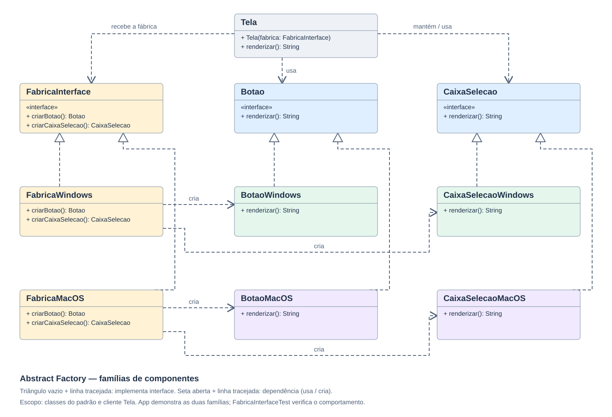

# Abstract Factory — Componentes de interface

Aplicação didática em Java 21 que cria famílias de componentes Windows e MacOS.
A renderização é simulada por texto no terminal: não abre janelas nem exige esses sistemas operacionais.

## Como funciona

Uma tela precisa de dois tipos de componente: um botão e uma caixa de seleção.
A fábrica Windows fornece os dois no estilo Windows; a fábrica MacOS fornece os dois no estilo MacOS.
Ao trocar a fábrica passada ao construtor de `Tela`, trocamos a família inteira.

| Papel no padrão | Classes |
| --- | --- |
| Fábrica abstrata | FabricaInterface |
| Fábricas concretas | FabricaWindows, FabricaMacOS |
| Produtos abstratos | Botao, CaixaSelecao |
| Produtos Windows | BotaoWindows, CaixaSelecaoWindows |
| Produtos MacOS | BotaoMacOS, CaixaSelecaoMacOS |
| Cliente | Tela |
| Demonstração | App |

`Tela` usa somente as interfaces e não contém decisões sobre Windows ou MacOS.
`App` escolhe as fábricas concretas. Cada fábrica concreta cria dois produtos compatíveis.
Os métodos retornam as interfaces dos produtos.

Adicionar uma família nova requer novos produtos e uma nova fábrica, sem mudar `Tela`.
Adicionar um novo tipo de produto exige alterar a interface da fábrica e todas as fábricas concretas.
A consistência da família é responsabilidade das implementações; a interface Java sozinha não impede uma fábrica mal implementada de misturar estilos.

## Diferença para Factory Method

No trabalho anterior, cada serviço escolhia uma implementação de notificação através de um método de criação.
Aqui, uma fábrica reúne a criação de vários tipos de produto relacionados: botão e caixa de seleção.
O ponto principal é fornecer uma família coerente de objetos ao cliente.

## Organização

- `src/`: código-fonte e classe de testes.
- `lib/`: JUnit Platform Console Standalone, reaproveitado do ambiente do trabalho anterior.
- `.vscode/settings.json`: configuração de pastas e biblioteca para VS Code.
- `executar.ps1`: compila e executa a aplicação.
- `testar.ps1`: compila e executa os testes.
- `diagrama-abstract-factory.svg`: imagem vetorial do diagrama.
- `bin/`: gerado pela compilação e ignorado pelo Git.

## Requisitos

JDK 21 com `java` e `javac` disponíveis no terminal.
Para usar o VS Code, utilize o Extension Pack for Java.
A biblioteca de testes está incluída em `lib`, sem necessidade de baixar dependências para estes comandos.

## Como executar

Abra esta pasta no VS Code e, no terminal PowerShell, execute:

~~~powershell
.\executar.ps1
~~~

Também é possível abrir `src/App.java` e clicar em Run acima do método main.

Saída esperada:

~~~text
Familia Windows:
Botao no estilo Windows
Caixa de selecao no estilo Windows

Familia MacOS:
Botao no estilo MacOS
Caixa de selecao no estilo MacOS
~~~

## Casos de teste

A classe `FabricaInterfaceTest` utiliza JUnit Jupiter (JUnit 5):

1. A fábrica Windows cria um botão Windows.
2. A fábrica Windows cria uma caixa de seleção Windows.
3. A fábrica MacOS cria um botão MacOS.
4. A fábrica MacOS cria uma caixa de seleção MacOS.
5. A tela renderiza os dois componentes da família Windows.
6. A tela renderiza os dois componentes da família MacOS.
7. A tela aceita uma fábrica de teste com novos produtos sem alteração de seu código.

Execute:

~~~powershell
.\testar.ps1
~~~

Ou abra o painel Testing do VS Code e execute `FabricaInterfaceTest`.

Resultado da validação: **7 testes executados e aprovados**.

## Diagrama de classes

As setas com triângulo vazio e linha tracejada indicam implementação de interface.
As setas abertas e tracejadas indicam dependências de uso ou criação.
O desenho cobre o padrão e a classe cliente Tela; App e a classe de testes estão fora do desenho.
Os campos privados de Tela são omitidos para simplificar: Botao botao e CaixaSelecao caixaSelecao.

## Explicação para apresentação

“Minha aplicação demonstra Abstract Factory criando famílias de componentes.
A interface FabricaInterface define como criar um botão e uma caixa de seleção.
FabricaWindows e FabricaMacOS fornecem suas próprias versões desses produtos.
A classe Tela recebe uma fábrica e usa as interfaces, sem conhecer as classes concretas.
Por isso, posso trocar a família dos componentes mudando a fábrica passada à tela.”

## Publicação

Use um repositório exclusivo para este padrão.
Antes de publicar, confira o prazo da atividade. Não faça commits depois do prazo definido pelo professor.

